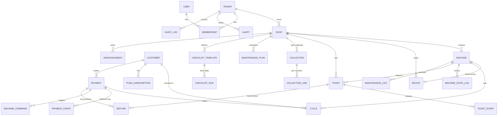

# 03 · Architecture

This document covers deliverables **7–11**: the domain model, API architecture, real-time events, IoT, and payments.

## 0. Shape of the system

The system is a **modular monolith**: one deployable, one Postgres database, and clear internal modules. It suits a solo developer and scales to hundreds of shops before anything needs to be split out.

```
                ┌───────────────────── one Node.js process (N replicas later) ─────────────────────┐
 Customer PWA ─▶│  HTTP API (Fastify)   /api/v1/public/*   /api/v1/owner/*   /api/v1/device/*       │
 Owner web    ─▶│  WebSocket hub  /ws   (channels: shop:*, tenant:*, customer:*)                     │
 Devices/bridge▶│                                                                                    │
 Pay gateways ─▶│  modules: catalog · machines/state · cycles · telemetry · tickets · refunds ·     │
                │           payments · analytics · maintenance · checklists · alerts · audit         │
                │  event bus (in-proc) ⇄ Postgres LISTEN/NOTIFY (cross-replica fan-out)             │
                │  job runner (Postgres table, FOR UPDATE SKIP LOCKED)                               │
                └───────────────┬───────────────────────────────────────────────┬──────────────────┘
                                │                                               │
                         PostgreSQL 16                               Web Push (VAPID) / email
                                ▲
 Phase 2:  shop devices ─MQTT─▶ broker (Mosquitto/EMQX) ─▶ mqtt-bridge worker ─▶ same telemetry module
```

**Stack**
- **Language:** TypeScript end to end, so types are shared between the API and both frontends. One language suits a solo developer. .NET/SignalR would work equally well, but the shared types and one toolchain win here.
- **Backend:** Fastify, Kysely (typed SQL; migrations are plain SQL), `pg`, zod validation, `@fastify/websocket`, `web-push`.
- **Frontend:** React, Vite and Tailwind. The customer side is an installable **PWA** at `/` (service worker for push and offline shell). The owner dashboard is at `/owner` in the same bundle, lazy-loaded so customers never download it.
- **Native app:** React Native (Expo) later, reusing the API client and i18n, and only if PWA limits (mainly iOS push without install) hurt measurably.

**Why not microservices:** the load is tiny. A 100-shop network produces about 3 telemetry messages per second on average. The hard problems are correctness (payments, state) and product fit, not throughput. Module boundaries are enforced by folder structure and by events between modules, so a module such as telemetry ingest can be extracted later if it's ever needed.

---

## 7. Domain model

All money is stored as integer **sen**. Timestamps are `timestamptz`. Analytics are bucketed in the shop's timezone (default `Asia/Kuala_Lumpur`). Every tenant-owned row carries `tenant_id`, and every query in the owner API is scoped by it (Phase 2 adds Postgres RLS as defence-in-depth).



### Core entities

| Entity | Key fields | Notes |
|---|---|---|
| `tenants` | `name`, `slug`, `plan` | One operator company or franchisee. |
| `users`, `memberships` | `role ∈ {owner, manager, staff}`, `shop_ids uuid[] \| null` | `null` means all shops. A user may belong to several tenants (for example a technician). |
| `shops` | `slug`, `address`, `lat/lng`, `opening_hours jsonb`, `facilities jsonb`, `policy jsonb (i18n)`, `settings jsonb` | Settings: fault-report threshold, uncollected reminder minutes, finished-hold minutes. |
| `machines` | `code` (e.g. `W3`, unique per shop), `qr_token` (random, global), `type ∈ {washer, dryer}`, `capacity_kg`, `programs jsonb`, `instructions jsonb (i18n)`, `recommended_load jsonb (i18n)`, `detergent_auto`, `softener_auto`, `observation ∈ {none, power_monitor, vendor}`, `control ∈ {none, simulated, pulse, vendor}` | **Observation and control are separate capabilities.** |
| machine state (columns on `machines`) | `admin_state ∈ {active, maintenance, disabled}`, `state`, `state_source ∈ {sensor, customer, staff, payment, system, none}`, `state_since`, `current_cycle_id`, `reported_issue_count` | `state` is *derived* by a single reducer (below) and denormalised for fast reads. |
| `machine_state_log` | `state`, `source`, `reason`, `started_at`, `ended_at` | Interval history, used for downtime tracking and the timeline. |
| `devices` | `kind ∈ {generic_power, shelly, esp32_ct, simulator}`, `token_hash`, `config jsonb` (thresholds), `last_seen_at`, `last_power_w`, `detector jsonb` (detector state) | One device observes one machine. A shop gateway may proxy many. |
| `cycles` | `source ∈ {customer, staff, sensor, payment}`, `status ∈ {running, finished, collected, cancelled, aborted}`, program snapshot (`program_id`, `name`, `duration_min`, `price_sen`), `started_at`, `expected_end_at`, `ended_at`, `collected_at`, `customer_id?`, `payment_id?`, `sensor_confirmed` | The **unit of utilisation**. A customer check-in and a sensor-detected cycle on the same machine within ±5 min are **merged**. The client provides the UUID, so retries are idempotent. |
| `customers` | `kind ∈ {guest, registered}`, `locale`, `phone?` | Guests are created silently. Their token is a signed JWT held in localStorage. |
| `push_subscriptions` | `endpoint (unique)`, `keys`, `customer_id? / user_id?` | Used for customer and owner push. |
| `tickets`, `ticket_events` | `ref` (human number), `category`, `severity`, `status ∈ {open, in_progress, resolved, rejected}`, `source ∈ {customer, staff, system}`, `machine_id?`, `cycle_id?`, `payment_id?`, `amount_claimed_sen`, `contact_phone` | Customer reports auto-link to the shop, machine and active cycle. |
| `refunds` | `amount_sen`, `method ∈ {original, duitnow, cash, other}`, `status ∈ {requested, approved, rejected, paid, failed}`, `payout_phone`, `reference`, `decided_by` | Automatic refunds (failed starts) are created with `status=approved` and paid through the gateway. |
| `payments`, `payment_events`, `machine_commands` | See §11 | |
| `collections`, `collection_lines` | `amount_sen`, `counter_reading?` per machine | Cash revenue by machine, and reconciliation against cycle counters. |
| `maintenance_plans`, `maintenance_logs` | plan: `interval_days?`, `interval_cycles?`, `interval_run_hours?`; scope is a machine, or a machine type in a shop | "Due" is computed from the last log plus counters since then. |
| `checklist_templates`, `checklist_runs` | template `items jsonb`; run `run_date`, `completed jsonb {itemId: {by, at}}` | One run per template per shop-local date. |
| `announcements` | `message jsonb (i18n)`, `level`, `starts_at`, `ends_at` | |
| `alerts` | `kind ∈ {repeat_fault, low_usage, maintenance_due, device_offline, start_failed, uncollected}`, `dedupe_key`, `status` | Only one open alert per `dedupe_key`. |
| `audit_log` | `actor`, `action`, `entity`, `before`, `after`, `ip` | Written for every owner-side mutation. |
| `jobs` | `kind`, `run_at`, `payload`, `status`, `attempts`, `dedupe_key` | Durable scheduled work: reminders, timeouts, sweeps. |

### Machine state reducer

A single pure function decides what a machine "is". Every source (sensor, check-in, staff, payment, jobs) calls `recomputeMachineState(machineId)`. It writes `machines.state` plus a `machine_state_log` row and emits `machine.state_changed` only when the state actually changes.

Precedence, highest first:
1. `admin_state = disabled` → **disabled**
2. `admin_state = maintenance` → **maintenance**
3. The machine has a device whose `last_seen_at` is older than `3 × heartbeat` → **offline**
4. Staff-confirmed fault, or `reported_issue_count ≥ shop.settings.faultReportThreshold` (distinct reporters within 2 h) → **fault**
5. An open cycle with `status = running` → **running** (the source is taken from the cycle)
6. A cycle finished less than `finishedHoldMin` ago and not collected → **finished** (laundry probably still inside)
7. Otherwise → **available**. The source is `sensor` if the machine is observed, otherwise `none` (meaning "no known activity"; the UI shows this with lower confidence).

---

## 8. API architecture

REST/JSON under `/api/v1`. It is documented by zod schemas in code. Every mutating customer endpoint accepts a client-generated UUID or `Idempotency-Key`, so retries on flaky shop Wi-Fi are safe.

### Public (customer): guest token optional except where noted
| Method | Path | Purpose |
|---|---|---|
| `POST` | `/public/guest` | Create a guest customer and return a token (silent, first visit) |
| `GET` | `/public/shops?lat=&lng=` | Nearby published shops with availability summary and busyness |
| `GET` | `/public/shops/:slug` | Shop detail, machines, announcements, busyness profile |
| `GET` | `/public/machines/:qrToken` | Machine page (QR landing) |
| `POST` | `/public/cycles` 🔑 | Start timer `{id, qrToken, programId}` (idempotent by `id`) |
| `GET` | `/public/me/cycles` 🔑 | Active and recent cycles for this customer |
| `POST` | `/public/cycles/:id/collected` 🔑 | Stop reminders; frees the machine sooner |
| `POST` | `/public/cycles/:id/cancel` 🔑 | Mistaken start |
| `POST` | `/public/reports` 🔑 | Problem report `{id, qrToken, category, details?, amountClaimed?, contactPhone?}` |
| `GET` | `/public/me/reports` 🔑 | The reporter's tickets and status |
| `POST` | `/public/push/subscribe` 🔑 | Register a web-push subscription |
| `GET` | `/public/push/vapid-key` | Public VAPID key |
| `POST` | `/public/payments` 🔑 | Create a payment for a controllable machine. **`Idempotency-Key` header required.** |
| `GET` | `/public/payments/:id` 🔑 | Poll payment, start status and receipt |
| `POST` | `/webhooks/payments/:provider` | Gateway callbacks (signature-verified, deduped) |

### Owner: httpOnly session cookie, RBAC per route
| Area | Endpoints (abridged) | Permission |
|---|---|---|
| Auth | `POST /owner/auth/login`, `POST /owner/auth/logout`, `GET /owner/me` | – |
| Overview | `GET /owner/overview` (branches, today's KPIs, needs-attention list) | any role |
| Shops | `GET/POST /owner/shops`, `GET/PATCH /owner/shops/:id` | `shops.manage` for writes |
| Machines | `GET/POST /owner/machines`, `PATCH /owner/machines/:id`, `POST /owner/machines/:id/admin-state`, `GET /owner/machines/:id` (timeline, 30-day stats), `GET /owner/machines/:id/qr.svg`, `GET /owner/shops/:id/qr-sheet` | `machines.manage` / `machines.state` |
| Devices | `POST /owner/devices` (returns the token once), `GET /owner/devices` | `machines.manage` |
| Tickets | `GET /owner/tickets`, `GET/PATCH /owner/tickets/:id`, `POST /owner/tickets` (staff-created), `POST /owner/tickets/:id/comments` | `tickets.manage` |
| Refunds | `GET /owner/refunds`, `POST /owner/refunds`, `POST /owner/refunds/:id/decision` | `refunds.decide` |
| Collections | `GET/POST /owner/collections`, `GET /owner/collections/reconciliation` | `collections.create` / `revenue.view` |
| Analytics | `GET /owner/analytics/revenue?groupBy=`, `/utilisation`, `/peak-hours`, `/capacity`, `/low-usage` | `revenue.view` |
| Maintenance | `GET/POST/PATCH /owner/maintenance/plans`, `GET /owner/maintenance/due`, `POST /owner/maintenance/logs` | `maintenance.manage` / `maintenance.log` |
| Checklists | `GET/POST/PATCH /owner/checklists/templates`, `GET /owner/checklists/today`, `POST /owner/checklists/runs/:id/items/:itemId` | `checklists.manage` / `checklists.complete` |
| Announcements | `GET/POST/PATCH/DELETE /owner/announcements` | `announcements.manage` |
| Alerts | `GET /owner/alerts`, `POST /owner/alerts/:id/ack` | any role |
| Staff | `GET/POST /owner/staff` | `staff.manage` |
| Audit | `GET /owner/audit` | `audit.view` |

**Roles → permissions**: *owner* has everything. *Manager* has everything except `staff.manage` and billing. *Staff* has `machines.state`, `tickets.manage`, `checklists.complete`, `maintenance.log` and `collections.create`, but **no revenue visibility**. They can record cash but can't see analytics, which reduces the incentive to skim.

### Device (Phase 2, available in the MVP)
| Method | Path | Purpose |
|---|---|---|
| `POST` | `/device/telemetry` | `Authorization: Bearer <device token>`. Body `{samples: [{ts, powerW, door?, fault?}]}`. Out-of-order samples are tolerated. |
| `POST` | `/device/heartbeat` | Keep-alive for devices that only report on change |
| `POST` | `/device/commands/:id/ack` | Controller acknowledges a start command |

---

## 9. Real-time event architecture

**Principle:** events are *hints* and REST is the *source of truth*. The UI applies event payloads optimistically, and re-fetches the snapshot on (re)connect. Nothing breaks if a socket drops. The UI falls back to polling every 30 s.

```
domain code ──emit(evt)──▶ EventBus.publish
                             ├─▶ pg_notify('dobi_events', {channel, type, data})   (≤ 8 KB)
                             │         │
                             │   every API replica LISTENs ──▶ local WS hub ──▶ sockets subscribed to channel
                             └─▶ in-process subscribers (push notifications, alert rules, job scheduling)
```

**Channels**
| Channel | Who can subscribe | Events |
|---|---|---|
| `shop:{shopId}` | anyone (public, no PII) | `machine.state_changed {machineId, state, source, since, remainingSec}` |
| `tenant:{tenantId}` | authenticated members (membership checked) | all of the above for their shops, plus `ticket.*`, `alert.created`, `refund.*`, `device.status`, `payment.updated` |
| `customer:{customerId}` | holder of that guest or customer token | `cycle.updated`, `payment.updated` |

**Protocol** (JSON over `/ws`): the client sends `{"op":"sub","channels":[...],"token"?}`, and the server sends `{"op":"evt","channel","type","data","ts"}`. There is a server ping every 25 s.

**Durable timing** doesn't live in sockets or `setTimeout`. It lives in the `jobs` table:
- `cycle.remind` at `expected_end − N min` sends the "5 minutes left" push.
- `cycle.finish` at `expected_end` finishes non-sensor cycles and sends the "Finished" push.
- `cycle.uncollected` at `ended + X min` sends a reminder (up to 2), then raises an owner alert if the shop has a policy.
- `payment.start_timeout` at `+90 s` retries the command once, then triggers an automatic refund.
- Periodic sweeps: device offline (every minute), maintenance due (hourly), low usage (daily), stale-payment reconciliation (every 5 min).

Jobs are claimed with `FOR UPDATE SKIP LOCKED`, so running several replicas is safe. A restart loses nothing. The `dedupe_key` makes scheduling idempotent (for example `cycle.remind:{cycleId}`).

**Scaling path:** Postgres NOTIFY comfortably handles hundreds of events per second. Beyond that, swap the bus transport for Redis pub/sub or NATS with no change to the domain code.

---

## 10. IoT architecture

### The key separation

| | **Observation** (Phase 2) | **Control** (Phase 3) |
|---|---|---|
| Question | "Is the machine running? Is it healthy?" | "Start this machine for this paid customer" |
| Applicability | Almost every machine (anything that draws power) | Only machines with a safe, supported interface |
| Risk | Low. Passive; clamp-on sensor, no wiring into the machine logic. | Higher: safety interlocks, warranty, fraud (fake start pulses) |
| Failure mode | Status shows "offline" and the shop works as normal | Must auto-refund. Coin operation must still work. |

The software models these as **independent capability flags** per machine (`observation`, `control`), each backed by a pluggable adapter.

### Observation hardware options (cheapest first)

| Option | How | Rough cost / machine | Notes |
|---|---|---|---|
| **Off-the-shelf Wi-Fi energy monitor with CT clamp** (Shelly Pro EM / EM Gen3, Shelly 1PM for low-current circuits, Tuya/Sonoff equivalents flashed or local-API) | A CT clamp on the machine's supply line reports power every 1–10 s over HTTP/MQTT | RM 80–250 | **No electrical modification to the machine.** Install by a registered wireman at the distribution board. Best for the pilot. |
| **ESP32 plus split-core CT (SCT-013) plus optional vibration (SW-420 / accelerometer) and door reed switch** | Custom firmware publishes MQTT with local buffering | RM 40–90 in parts | Cheapest at scale, and can buffer offline. Needs firmware maintenance. |
| **Per-shop gateway** (Raspberry Pi / mini-PC, or ESP32 with RS485) | Aggregates many sensors, buffers during internet outages, bridges MQTT | RM 200–400 per shop | Use a 4G router fallback where shop broadband is poor. |
| **RS485 / Modbus / manufacturer interface** | Read controller state (program, remaining time, error codes) | Varies | Only on models that expose it. Richest data; per-vendor adapter. |

**Cycle detection from power** is a pure, per-device-configurable state machine, implemented in the MVP as `apps/api/src/modules/telemetry/detector.ts`:
- `idle → running` when `power > startW` continuously for `startSec` (this filters door-lock blips).
- `running → idle` when `power < endW` continuously for `endSec`. Washers need a long `endSec` (≈ 4 min) because fill and soak phases draw little power. Dryers need a short one (≈ 90 s).
- Cycles shorter than `minCycleSec` are discarded as noise. A `maxCycleMin` guard closes stuck cycles and raises an alert.
- Gas dryers still draw motor and fan current (a few hundred W), so detection works. Electric-dryer heater failure shows as a low average power, which is a Phase 2 anomaly rule.

### Messaging

```
[sensor] ──(HTTP POST / MQTT)──▶ [shop gateway, optional] ──MQTT/TLS──▶ [broker]
     topic: dobi/{tenant}/{shop}/{device}/telemetry   (QoS 1, buffered)
     topic: dobi/{tenant}/{shop}/{device}/status      (retained, LWT = "offline")
     topic: dobi/{tenant}/{shop}/{device}/cmd         (control only, QoS 1)
[broker] ──▶ mqtt-bridge worker ──▶ telemetry module (same code path as HTTP ingest)
```

- Per-device credentials, and broker ACLs restricted to the device's own topics.
- The broker's last-will-and-testament gives instant offline detection. The heartbeat sweep is the backstop.
- In the MVP, devices post directly over HTTPS. MQTT is added when the first shop has more than 5 sensors.

### Adapter interfaces (in code)

```ts
interface ObservationAdapter {           // turns vendor payloads into normalised samples
  kind: DeviceKind;
  parse(payload: unknown): TelemetrySample[];   // {ts, powerW, door?, fault?}
}
interface MachineController {            // only for machines with control != 'none'
  kind: ControlKind;
  start(cmd: { commandId: string; machine: Machine; program: Program }): Promise<void>; // idempotent by commandId
}
```

A **start is only considered successful when observation confirms it** (the sensor sees a cycle start, or the vendor API reports running). The controller's own "OK" is not enough. This one rule is what makes "payment deducted but machine not running" self-healing.

### Control options (Phase 3, per model, opt-in)
- **Coin-pulse emulation:** a relay or opto-isolator wired in parallel to the coin acceptor's pulse line. This is the approach many QR retrofit boards use. The coin path keeps working. It needs model-specific pulse timing, tamper-proof enclosures, and installation by a technician. **Never** bypass door locks or safety interlocks.
- **Vendor APIs / Modbus:** preferred where available.

---

## 11. Payment architecture

### Money flow
- **Direct-to-merchant.** Each owner has their own gateway merchant account, and funds settle to the owner's bank. The platform **never holds customer funds**. That avoids e-money and payment-facilitator licensing and keeps refund liability with the merchant of record.
- A platform fee (if any) is billed monthly as part of the SaaS invoice. It's not skimmed from each transaction, which keeps gateway integration simple.
- **Rail choice is decided by ticket size.** A wash costs RM 4–10. FPX and cards carry a fixed fee of about RM 1 (10–25% of the ticket). Stripe MY doesn't offer DuitNow QR. **Dynamic DuitNow QR at about 1–1.2%** (CHIP: 1.0%, min RM 0.15; HitPay: 1.2%; Curlec also has a documented QR refund API) is the default rail, with e-wallets as the fallback. Adapters are selected per tenant. The first real adapter should be CHIP or HitPay, after confirming **refund-API support for DuitNow QR in sandbox** (unverified for most gateways; see research/competitor-research.md §3). The MVP ships a `mock` gateway implementing the same interface.

### Payment state machine

```
created ──redirect──▶ pending ──webhook ok──▶ succeeded ──start confirmed──▶ (cycle running)
   │                     │                        │
   │                     ├─webhook fail──▶ failed  └─start not confirmed in 90 s (after 1 retry)
   │                     └─expired (15 min, reconciled with gateway)          │
   └─(duplicate Idempotency-Key → return existing)                             ▼
                                                            refund_pending ──gateway ok──▶ refunded
                                                                    └─gateway fail──▶ ticket + alert (manual)
```

### Guarantees
1. **Idempotent creation.** `Idempotency-Key` is unique per customer. A retry returns the same payment and never charges twice.
2. **Webhook deduplication.** `payment_events(provider, provider_event_id)` is unique. The payment transition is a single `UPDATE … WHERE status = 'pending'`, so a duplicate or late webhook is a no-op.
3. **Exactly one start command per payment.** `machine_commands.payment_id` is unique. The command id doubles as the device-side idempotency key.
4. **Confirmation by observation.** The cycle is only `running` when the sensor confirms it. Otherwise it's automatically refunded, and a ticket and alert are created for the owner ("W3 failed to start after payment").
5. **Reconciliation.** A job polls the gateway for payments stuck in `pending` beyond 15 min. A daily settlement report is compared against succeeded payments.
6. **Precondition checks** before charging: the machine is `available`, controllable, its device is online, and the shop is open. Coin operation is never blocked.
7. **Auditability.** Every state change is kept with timestamps. Receipts are generated from the payment row.

### Cash and existing QR systems
Most shops keep coins or their existing QR boards. Revenue from those enters as **collections** (per machine, with counter readings) and, in Phase 2, **CSV/API imports**. Analytics always label which sources a figure includes.

---

## Notifications and messaging (added after the MVP)

- `Notifier` fans customer notifications out to **web push** (every subscribed device) and **WhatsApp** (if linked).
- **WhatsApp linking is customer-initiated:**
  1. `POST /public/whatsapp/link` returns a `wa.me/<business number>?text=DOBI-XXXXXX` link, valid for 30 minutes.
  2. The customer presses send.
  3. The Cloud API webhook (`/webhooks/whatsapp`, X-Hub-Signature-256 verified) calls `handleInbound`, which links `wa_contacts.wa_id` to the guest and stamps `last_inbound_at`.
- **Sending rule:** free-form text only while `now − last_inbound_at < 24 h − 10 min`, which is WhatsApp's customer-service window and so costs nothing. Outside it, only an approved template is sent, and only where configured (the owner digest). Otherwise the message is skipped and logged as `skipped_window`.
- STOP/START are handled. The transport is pluggable (`CloudApiTransport` / `MockWhatsAppTransport`).
- **Weekly digest:** the hourly `sweep.digest` sends on Monday from 08:00 in the tenant's timezone. `digest_log (tenant, week_start)` makes it exactly-once across replicas. Recipients are owners and managers, each with a digest scoped to their shops. Revenue is included only with `revenue.view`.
- **Mail** goes through a `MailTransport`: SMTP when `SMTP_URL` is set, otherwise logged.

## Photos

- **Storage:** an `attachments` row plus a `BlobStore`: local disk for a single-VPS pilot, and an S3-compatible implementation when running multiple replicas.
- **Upload:** the raw image body is posted (`/public/uploads` for guests, `/owner/uploads` for staff), max 3 MB. The type is taken from the magic bytes, never from the declared `Content-Type`.
- **Linking:** photos are linked to a ticket (customer's own uploads only) or to a checklist item (the uploader's own). Unlinked uploads are deleted after 24 h.
- **Serving:** `/owner/attachments/:id` is cookie-authenticated with a shop-access check, and sends `nosniff`, a restrictive CSP and a private cache.

## Cross-cutting

- **Security:** argon2 or bcrypt password hashes; httpOnly SameSite=Lax session cookie for owners; guest tokens have low privilege (they only reach the guest's own cycles and reports); per-device tokens stored hashed; rate limiting on public POSTs; QR tokens are random (not guessable sequences). **QR tampering ("quishing"):** stickers point only to our domain, and the page shows the machine code, which must match the machine's physical label. Payments never happen outside our domain or the gateway's.
- **Privacy (Malaysian PDPA):** guests are anonymous. Phone numbers are collected only for refunds, with the purpose shown. The daily `sweep.privacy` job enforces retention: refund phone numbers 90 days after a case closes, report photos 180 days, inactive WhatsApp numbers 180 days, the WhatsApp message log 30 days. Host in Malaysia or Singapore.
- **Audit log** for every owner-side write: actor, before/after, IP.
- **Observability:** structured logs (pino), request ids, a `/health` endpoint, job-failure counters, and alerts on job backlog.
- **Offline and failure safety:** client-side idempotent UUIDs with retry, and a countdown that keeps running locally without a network. The shop never depends on our uptime: machines still take coins. Pay-in-app is hidden when the device is offline.
